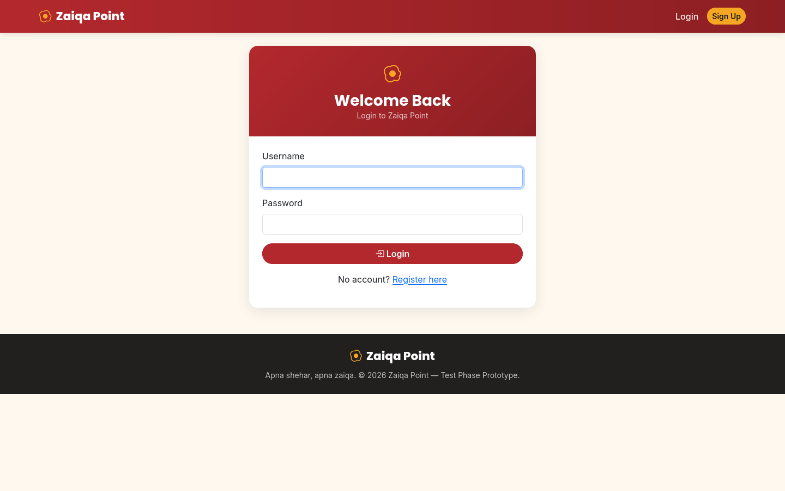
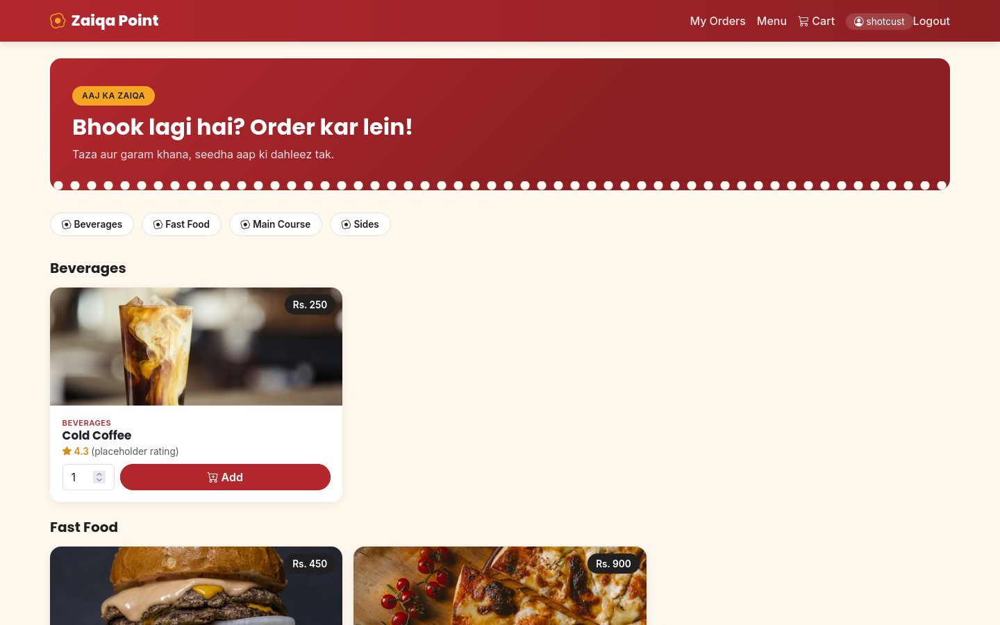
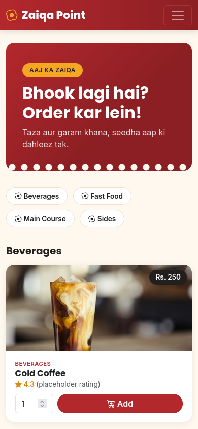
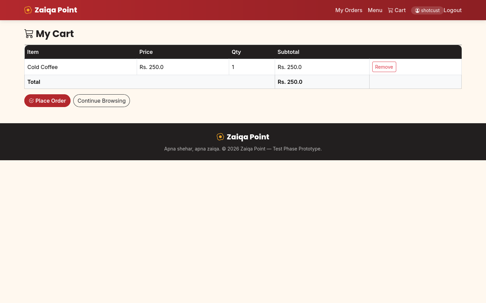
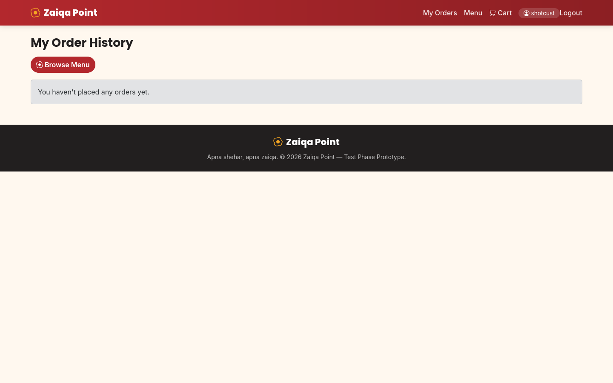
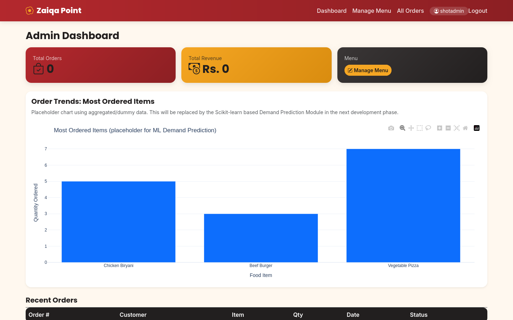
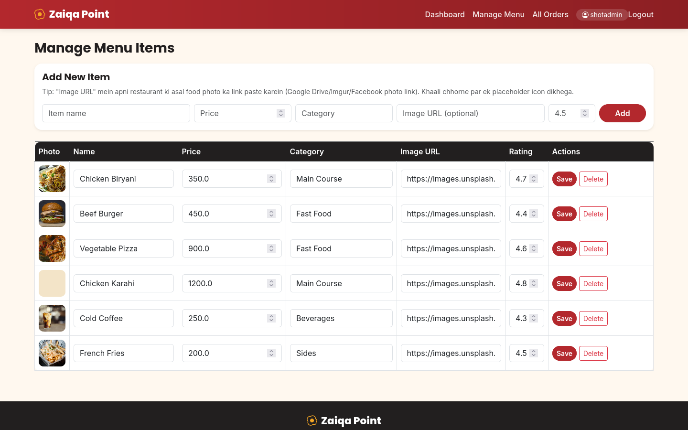

# 🍽️ Zaiqa Point — Online Food Ordering System


A simple, working online food-ordering web app built with Python and Flask.
Customers browse the menu, add items to a cart and place orders; admins manage
the menu and watch an order-trend chart on their dashboard. The database is
SQLite, so it runs anywhere Python runs — no extra services needed.

## Features

- **Accounts** — register and log in; admins and customers have separate roles.
- **Customer side** — browse the menu by category, add items to a cart,
  check out, and see order history on a personal dashboard.
- **Admin side** — add/edit/delete menu items (name, price, category, photo,
  rating) and view every order.
- **Dashboard chart** — "Most Ordered Items" bar chart built with Plotly
  (a placeholder slot for a future ML demand-prediction module).
- **Auto setup** — tables are created and a small demo menu is seeded on
  first run.
- **Security hardening** — hashed passwords, CSRF-protected forms, session
  cookies hardened, no seeded credentials, public registration can only
  create customer accounts.

## Tech Stack

| Layer     | Choice                          |
|-----------|---------------------------------|
| Backend   | Python 3, Flask                 |
| Database  | SQLite via SQLAlchemy ORM       |
| Auth      | Session-based, Werkzeug hashing |
| Forms     | Flask-WTF (CSRF protection)     |
| Frontend  | HTML, Bootstrap 5, CSS          |
| Charts    | Plotly                          |

## Screenshots

### Login


### Menu (desktop)


### Menu (mobile)


### Cart


### Customer dashboard


### Admin dashboard


### Admin menu management


## Installation

Requires **Python 3.10+**.

```bash
# 1. Create and activate a virtual environment
python -m venv venv
source venv/bin/activate        # Windows: venv\Scripts\activate

# 2. Install dependencies
pip install -r requirements.txt

# 3. Set the secret key (required — the app will not boot without it)
export SECRET_KEY="<a long random string>"   # generate with: python -c "import secrets; print(secrets.token_hex(32))"
```

See `.env.example` for the full list of environment variables.

## Environment variables

| Variable              | Required | Default                                       | Purpose                                              |
|-----------------------|----------|-----------------------------------------------|------------------------------------------------------|
| `SECRET_KEY`          | Yes      | — (app refuses to boot without it)            | Signs session cookies                                |
| `DATABASE_URL`        | No       | `sqlite:///food_ordering.db` next to `app.py`  | SQLAlchemy database URL                              |
| `FLASK_DEBUG`         | No       | `0`                                           | Set to `1` for local development only                |
| `SESSION_COOKIE_SECURE` | No     | `1`                                           | Set to `0` for plain-HTTP local development          |
| `ADMIN_USERNAME`      | *        | —                                             | Used by `scripts/create_admin.py`                    |
| `ADMIN_PASSWORD`      | *        | —                                             | Used by `scripts/create_admin.py` (min 12 characters)|

\* required only when creating the first admin account.

## Usage

```bash
# 1. Create the first admin account (only supported way to make an admin)
export SECRET_KEY="<your secret key>"
export ADMIN_USERNAME="owner"
export ADMIN_PASSWORD="<strong unique password, min 12 chars>"
python scripts/create_admin.py

# 2. Run the app
python app.py
```

Open http://127.0.0.1:5000 in your browser.

- **Customers** sign up on the register page (registration always creates a
  customer account — never an admin).
- **Admins** log in and use *Admin Dashboard* and *Manage Menu*.
- Menu photos: in *Manage Menu*, paste a direct `http(s)` image link per item.

> **Note:** on first run the database file `food_ordering.db` is created
> automatically along with a small demo menu.

## Running tests

```bash
SECRET_KEY=test-secret python -m unittest discover -s tests -v
```

The suite covers privilege-escalation (register can't create admins), missing
default credentials, POST-only state changes, image-URL validation, and the
CSRF token plumbing of register → login → add-to-cart with real tokens.
GitHub Actions runs these on every push.

## Project structure

```
.
├── app.py                     # Flask app: models, routes, validation
├── scripts/
│   └── create_admin.py        # Creates the first admin account
├── templates/                 # Jinja2 templates (Bootstrap 5 UI)
├── static/css/style.css       # Custom styles
├── tests/test_basic.py        # Security regression tests
├── docs/screenshots/          # UI screenshots
├── requirements.txt
├── .env.example               # Documented environment variables
└── UPGRADE_NOTES_URDU.txt     # Upgrade notes (Roman Urdu)
```

## License

MIT — see [LICENSE](LICENSE). © 2026 Azmat Hayat.
